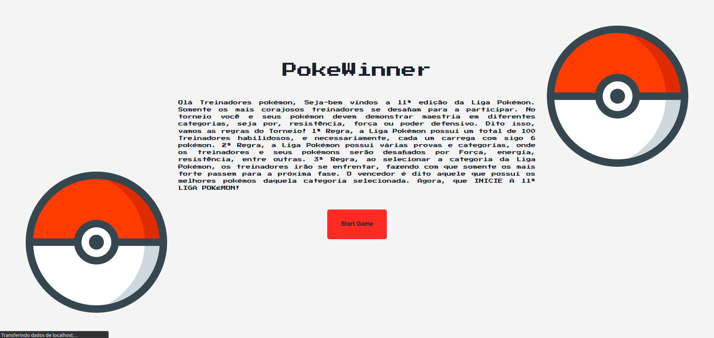
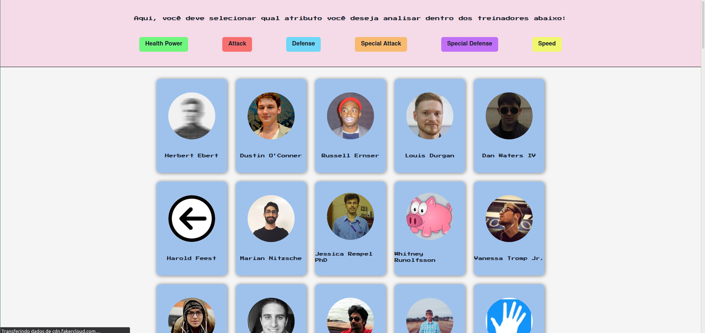
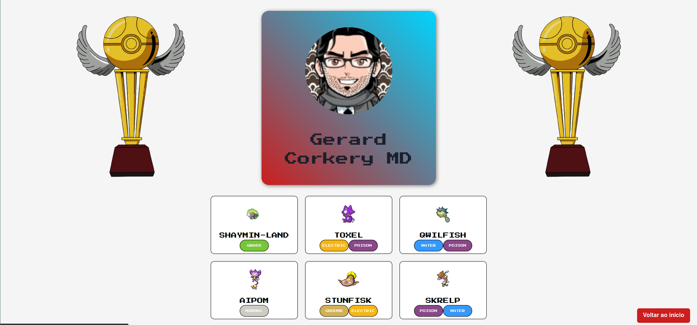

# FINAL - POKE WINNER

**Número da Lista**: 10<br>
**Conteúdo da Disciplina**: Projeto Final<br>

## Alunos
|Matrícula | Aluno |
| -- | -- |
| 15/0120371  |  Bruno Oliveira Dantas |
| 17/0031438 |  Dâmaso Júnio Pereira Brasileo |

## Sobre 

O `PokeWinner` é um seletor de vencedores... Tá, mas e ai?

Pode parecer simples, mas muito lógica foi utilizada por trás.

Primeiramente são selecionados desde os primórdios do mundo Pokemon, 100 treinadores muito engajados em querer ser o campeão. Mas claro que só podemos ter 1 vencedor no final, então você vai ser aquele que vai "escolher" o vencedor pela característica que você acha mais importante. Dito isso, é feita uma escolha bastante crucial.
Cada treinador tem sua força própria, e então são selecionados a partir de uma busca no grafo de batalhas dos treinadores os melhores, e então o vencedor está entre esses que então é avaliado a força dos seus pokemons.

## Screenshots







## Vídeo

## Instalação 

**Linguagem**: TypeScript<br>
**Framework**: ReactJS com Chakra UI<br>

Para instalação do projeto, é necessário executar os seguintes comandos:
```
git clone https://github.com/projeto-de-algoritmos/Final_PokeWinner

cd Final_PokeWinner

yarn install
```

## Uso 

Para execução do projeto é necessário, após a instalação:
```
cd DC_BatalhaHerois
cd app

yarn start
```

## Outros 
O comando `yarn` pode ser trocado por `npm`:
```
npm install

npm start
```

É necessário ter o `NPM` ou `YARN` instalado.


